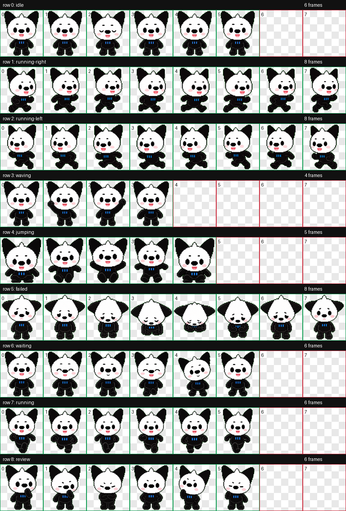
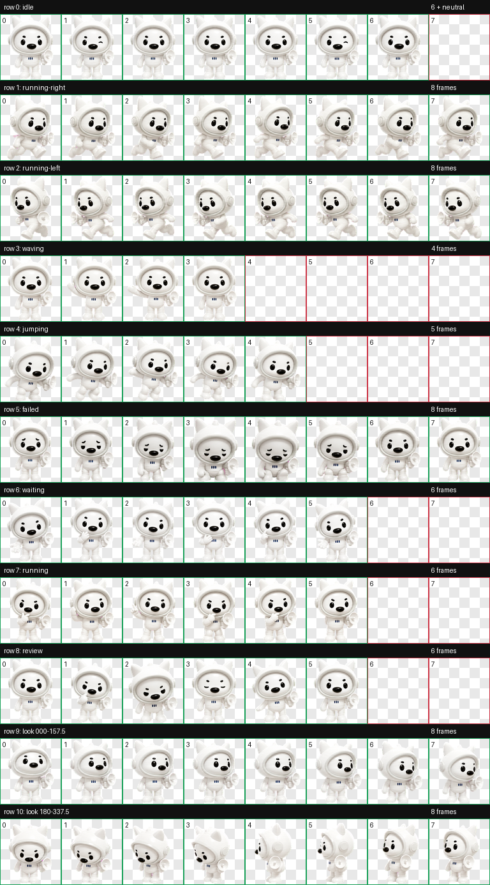

# Dizi Codex Pets

这个仓库收录了两只可以配置到 Codex 的谛仔宠物：经典 Dizi 和太空小谛。

## 宠物目录

| 宠物 | Codex 规格 | 安装文件 | 预览 |
| --- | --- | --- | --- |
| Dizi（谛仔） | v1，8 x 9 图集 | [`pet.json`](pet.json) + [`spritesheet.webp`](spritesheet.webp) | [`contact-sheet.png`](contact-sheet.png) |
| 太空小谛 | v2，8 x 11 图集，含 16 个观察方向 | [`pets/space-dizi/pet.json`](pets/space-dizi/pet.json) + [`pets/space-dizi/spritesheet.webp`](pets/space-dizi/spritesheet.webp) | [`contact-sheet.png`](pets/space-dizi/contact-sheet.png) / [`look-directions.png`](pets/space-dizi/look-directions.png) |

### Dizi（谛仔）

Dizi 是一只友好机灵的黑白动画宠物，拥有大号黑色耳朵，胸前有三道蓝色短线。

### 太空小谛

太空小谛穿着白色太空服、戴猫耳头盔，并随身带着小喇叭。它使用 Codex v2 宠物格式，除了 9 个标准动画状态，还包含 16 个顺时针观察方向。

## 安装方法

1. 在上表中选择一只宠物。
2. 下载该宠物目录中的 `pet.json` 和 `spritesheet.webp`，保持两个文件位于同一目录。
3. 打开 Codex 的 **Settings -> Pets**。
4. 选择 **Import Codex sprite**，导入对应的 `spritesheet.webp`，并按界面提示完成设置。

也可以从仓库右侧的 **Releases** 下载已经整理好的 ZIP 安装包。

## 哪些文件用于配置

- `pet.json`：必需。包含宠物 ID、显示名称、描述、图集路径和格式版本。
- `spritesheet.webp`：必需。Codex 实际读取的透明动画图集。
- `contact-sheet.png`：预览文件，不参与安装。
- `look-directions.png`：v2 观察方向预览，不参与安装。
- `previews/*.gif`：各动画状态的动态预览，不参与安装。
- `qa/*.json`：校验和视觉 QA 记录，不参与安装。

`.DS_Store` 和含本机绝对路径的原始运行摘要不属于宠物配置文件，因此没有发布。

## 图集规格

| 规格 | Dizi | 太空小谛 |
| --- | --- | --- |
| 尺寸 | 1536 x 1872 | 1536 x 2288 |
| 网格 | 8 x 9 | 8 x 11 |
| 单元格 | 192 x 208 | 192 x 208 |
| 格式 | RGBA WebP | RGBA WebP |
| 版本 | v1 | v2 (`spriteVersionNumber: 2`) |

标准动画状态包括 `idle`、`running-right`、`running-left`、`waving`、`jumping`、`failed`、`waiting`、`running` 和 `review`。

## Validation

太空小谛已经通过当前 `hatch-pet` 校验器：图集尺寸和透明度正确、所有必需单元格有效、未发现不透明色键像素或透明 RGB 残留。完整的可移植 QA 记录位于 [`pets/space-dizi/qa`](pets/space-dizi/qa)。

## License

No license is granted unless a license file is added to this repository.
